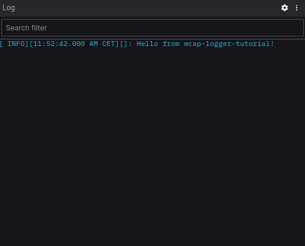

# Create Our First Log (old version)

## Setup Our Tutorial Project

!!! note ""

    In this tutorial we will use `uv`.

Let's [create a new uv project](https://docs.astral.sh/uv/guides/projects/) and
[add the MCAP Logger](installation.md) package as dependency.

```shell
uv init mcap_logger_tutorial
cd mcap_logger_tutorial
uv add mcap-logger
```

After this we should have the following elements in the project's folder:

```
.
├── .python-version
├── README.md
├── hello.py
└── pyproject.toml
```

We can run our "Hello World" program with the following command:

```shell
uv run hello.py
```

This should produce the following output on your console:

```
Hello from mcap-logger-tutorial!
```

We will use this "Hello World" program as a base for our tutorial.

## Create Our First Log

First, let's import the `get_logger` function into the `hello.py` script. This function takes care of making sure that
we can create our log file and setting up the console logging.
After we did the import, we will create our `MCAPLogger` entity with the `get_logger` function.

```python title="hello.py" linenums="1"
from mcap_logger.mcap_logger import get_logger


def main():
    logger = get_logger()
    print("Hello from mcap-logger-tutorial!")
```

Notice that we are missing some crucial arguments to create an `MCAPLogger`.

First we need to specify the **name of the logger**. We will use `hello` for this tutorial.

Then we will define the log file we want to create. To do that, we need to import `Path` and
specify **the log file's name and path**. In this case the log file will be called `hello.mcap` and we will place it
in the project's directory.

We will specify the **level of logging** for the console to be `DEBUG`.

!!! info "Defining log level"

    The level of logging only affects the console logging. The `.mcap` file always contains logs at every level.

```python title="hello.py" linenums="1"
from mcap_logger.mcap_logger import get_logger
from pathlib import Path


def main():
    log_file = Path("hello.mcap")
    logger = get_logger(name="hello", log_file=log_file, level="DEBUG")
    print("Hello from mcap-logger-tutorial!")
```

After all of this, we have our `MCAPLogger` and we can create logs with it.
We will remove the original `print` statement and replace it with an info level log call.

```python title="hello.py" linenums="8"
    logger.info("Hello from mcap-logger-tutorial!")
```

## Create The Log File

Now that we created our `MCAPLogger` and called one of its log functions, we can run our example again and see the
result.

```shell
uv run hello.py
```

The output should look something like this on the console:

```
[2024-11-03 11:40:37,505] [hello.main:8] [INFO] Hello from mcap-logger-tutorial!
```

Notice that we have a new file in our project directory called `hello.mcap`. This file is serialized with
[Protobuf](https://protobuf.dev/), so we can not open it with a text editor and look at the content of it.
To do that we will use [Foxglove Studio](https://foxglove.dev/download).

## Open Our Log File

Open Foxglove Studio and use the `Open local file...` command to open our `hello.mcap` log file. Our log messages is
using Foxglove's [Log schema](https://docs.foxglove.dev/docs/visualization/message-schemas/log), and we can visualise it
with a [Log panel](https://docs.foxglove.dev/docs/visualization/panels/log).

We can add a panel following [this guide](https://docs.foxglove.dev/docs/visualization/panels/introduction), and after
that we need to configure it to use the `/log` topic.

{ width="300" }
/// caption
log panel settings
///

After this we should see our info message on the log panel.

{ width="300" }
/// caption
log panel output
///

And Voilà! We made our first log with `mcap-logger`. :wink:

!!! tip "Filtering logs"

    Notice that in Foxglove Studio, you can filter the logs by their level in the log panel.
