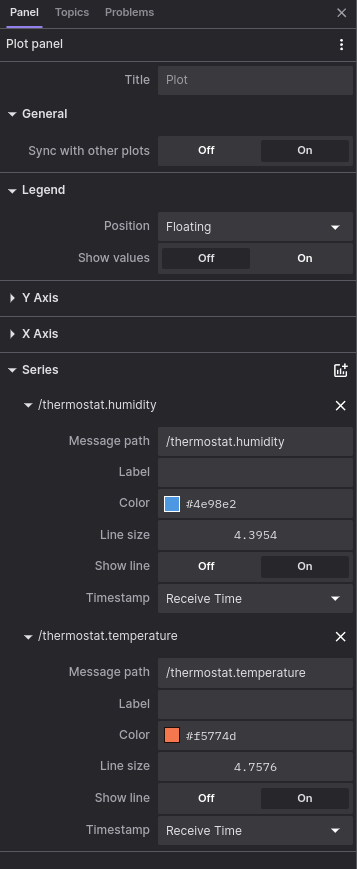
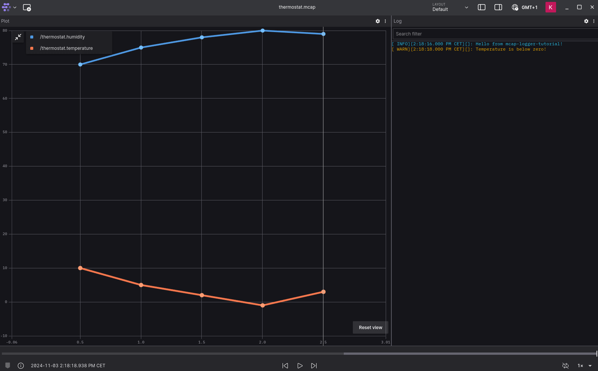

from mcap_logger.demo.demo import logger

# Logging Sensor Data

In this tutorial, we will log sensor data from a simulated thermostat into `thermostat.mcap` file.

## Setup Our Tutorial Project

!!! note ""

    In this tutorial we will use `uv`.

Let's [create a new uv project](https://docs.astral.sh/uv/guides/projects/) and
[add the MCAP Logger](installation.md) package as dependency.

```shell
uv init mcap_logger_tutorial
cd mcap_logger_tutorial
uv add mcap-logger
```

After this we should have the following elements in the project's folder:

```
.
├── .python-version
├── README.md
├── hello.py
└── pyproject.toml
```

We will change the `hello.py` to `thermostat.py` shown below.

```python title="thermostat.py" linenums="1"
from pathlib import Path

from mcap_logger.mcap_logger import get_logger

THERMOSTAT_DATA = [
    {"temp": 10, "humid": 70},
    {"temp": 5, "humid": 75},
    {"temp": 2, "humid": 78},
    {"temp": -1, "humid": 80},
    {"temp": 3, "humid": 79},
]


def main():
    log_file = Path("thermostat.mcap")
    logger = get_logger(name="thermostat", log_file=log_file, level="DEBUG")
    logger.info("Hello from mcap-logger-tutorial!")


if __name__ == "__main__":
    main()
```

!!! note "Simulated Thermostat"

    The thermostat readings comes from the THERMOSTAT_DATA dictionary.

## Installing ProtoBuf

[Protocol Buffers](https://protobuf.dev/) (a.k.a ProtoBuf) are Google's language-neutral mechanism for serializing
structured data. It is used as the serialisation protocol for `mcap-logger`.

We need to install the ProtoBuf compiler called `protoc` in order to work with ProtoBuf.
[Download the package](https://protobuf.dev/downloads/) and follow the instructions in the `README`.

We can confirm the installation with running the `protoc --version` command in the terminal.

## Creating Our Protocol Format

To specify our protocol format for the sensor data, we need to create a `thermostat_data.proto` file in our project
directory. The definitions in a `.proto` file are simple: we add a _message_ for each data structure we want to
serialise, then specify a name and a type for each field in the message.

Our thermostat has `temperature` and `humidity` readings, so our `.proto` file will look like the following.

```protobuf title="thermostat_data.proto"
syntax = "proto3";

message ThermostatData {
  int32 temperature = 1;
  int32 humidity = 2;
}
```

!!! info "ProtoBuf Syntax"

      This is the [Language Guide](https://protobuf.dev/programming-guides/proto3/) for proto3.

!!! tip "[Protobuf Python tutorial](https://protobuf.dev/getting-started/pythontutorial/)"

## Compiling Our Protocol Buffers

After we defined our protocol, we need to generate the Python classes to read and write messages.
To do that we will run the `protoc` compiler on our `.proto` file.

```shell
protoc --python_out=. thermostat_data.proto
```

This will generate a new Python file called `thermostat_data_pb2.py` in our project directory.

Our project directory should look something like this by now:

```
.
├── .python-version
├── README.md
├── hello.py
├── pyproject.toml
├── thermostat_data.proto
└── thermostat_data_pb2.py
```

## Importing ProtoBuf

To create a `thermostat data` in our `hello.py` script, we need to import the `ThermostatData` class from the generated
`thermostat_data_pb2.py`.

```python title="thermostat.py"
from thermostat_data_pb2 import ThermostatData
```

!!! warning

    In some cases the import can confuse the linter and generate _"Cannot find reference"_ errors. However the
    interpreter will work with this import. This can be resolved if you add plugins to your IDE for ProtoBuf support.

For example, now we can define our `thermostat data` as the following:

```python
thermostat_data = SensorData(temperature=20, humidity=65)
```

## Log The Sensor Data

After our first info log message, we will create a for loop with sleeping for 0.5 second to simulate the reading out of
a thermostat sensor.

```python title="thermostat.py" linenums="19"
    for data in THERMOSTAT_DATA:
    time.sleep(0.5)
    temperature = data["temp"]
    humidity = data["humid"]

    thermostat_data = ThermostatData(temperature=temperature, humidity=humidity)
```

To log the `thermostat_data`, we need to specify a _Topic_ for our log. In this case, we will call it `/thermostat`
topic, and we will call the `MCAPLogger`'s `topic` function to create it. _Topics_ have a `write()` function that
will log the data into the log file. So with calling `logger.topic(<topic_name>).write(<data>)` we can log
any ProtoBuf data into our log file.

```python title="thermostat.py"
logger.topic('/thermostat').write(thermostat_data)
```

To make it a bit more interesting, let's log a warning message when the `temperature` goes below zero!
Now our `thermostat.py` script should look like this:

```python title="thermostat.py"
import time
from pathlib import Path

from mcap_logger.mcap_logger import get_logger

from thermostat_data_pb2 import ThermostatData

THERMOSTAT_DATA = [
    {"temp": 10, "humid": 70},
    {"temp": 5, "humid": 75},
    {"temp": 2, "humid": 78},
    {"temp": -1, "humid": 80},
    {"temp": 3, "humid": 79},
]


def main():
    log_file = Path("thermostat.mcap")
    logger = get_logger(name="thermostat", log_file=log_file, level="DEBUG")
    logger.info("Hello from mcap-logger-tutorial!")

    for data in THERMOSTAT_DATA:
        time.sleep(0.5)
        temperature = data["temp"]
        humidity = data["humid"]

        thermostat_data = ThermostatData(temperature=temperature, humidity=humidity)
        logger.topic('/thermostat').write(thermostat_data)

        if temperature < 0:
            logger.warning("Temperature is below zero!")


if __name__ == "__main__":
    main()
```

## Running The Thermostat

After finishing the `thermostat.py` script, we can run it to generate the log file.

```shell
uv run thermostat.py
```

We should see the generated log messages on the console, including the `/thermostat` topic messages.

```
[2024-11-03 14:18:16,436] [thermostat.main:20] [INFO] Hello from mcap-logger-tutorial!
[2024-11-03 14:18:16,937] [thermostat.write:50] [DEBUG] /thermostat topic:
message=temperature: 10
humidity: 70

[2024-11-03 14:18:17,437] [thermostat.write:50] [DEBUG] /thermostat topic:
message=temperature: 5
humidity: 75

[2024-11-03 14:18:17,937] [thermostat.write:50] [DEBUG] /thermostat topic:
message=temperature: 2
humidity: 78

[2024-11-03 14:18:18,438] [thermostat.write:50] [DEBUG] /thermostat topic:
message=temperature: -1
humidity: 80

[2024-11-03 14:18:18,438] [thermostat.main:31] [WARNING] Temperature is below zero!
[2024-11-03 14:18:18,938] [thermostat.write:50] [DEBUG] /thermostat topic:
message=temperature: 3
humidity: 79
```

!!! tip "Using less verbose output in the console"

    Notice that you can change the log level of the console logging with the `level` argument for `get_logger` function.
    This can be useful if you need less verbose log messages in the console (e.g.: only >warning messages) to
    keep the execution clean. The MCap log is not affected by this parameter.

And we should have the generated `thermostat.mcap` in our project directory.

## Opening Our Log File

Open Foxglove Studio and use the `Open local file...` command to open our `thermostat.mcap` log file.
We need to [change the layout](https://docs.foxglove.dev/docs/visualization/panels/introduction) so that we have
a _Log_ panel and a _Plot_ panel.

In the settings we will configure the _Log_ panel to use the `/log` topic, and for the _Plot_ panel we will add two
_Series_: one for the `/thermostat.humidity` and one for the `/thermostat.temperature`.

{ width="300" }
/// caption
log panel settings
///

{ width="300" }
/// caption
plot panel settings
///

After this, we can play back the log and see the visualisation of the thermostat data alongside with the log messages.

{ width="600" }
/// caption
thermostat log in Foxglove
///

Now you know how to make full use of the `mcap-logger` package. :student:
